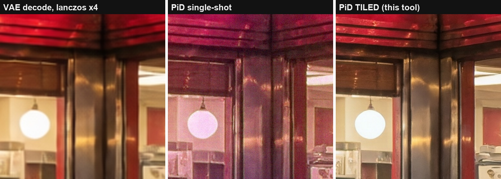

# ComfyUI-Latent-Tiled-PiD

**Tile the latent, not the pixels.**

[](https://github.com/BennyDaBall930/ComfyUI-Latent-Tiled-PiD/actions/workflows/selftest.yml)
[](LICENSE)

Latent-native tiled decoding for NVIDIA [PiD](https://research.nvidia.com/labs/sil/projects/pid/)
(Pixel Diffusion Decoder, [arXiv:2605.23902](https://arxiv.org/abs/2605.23902)) as native ComfyUI
nodes. One node between KSampler and SaveImage: slices the **generation latent** into overlapping
tiles, decodes every tile as a normal-sized in-envelope PiD job, feather-blends the pixels. Seam-free
33MP from a 2MP latent in about a minute — verified up to **107MP** (13824x7776), with cost scaling
~linearly at roughly **1MP of finished output per second on a single RTX 5090**.


## Why this exists

Single-shot PiD decoding is only trained for the 1024→4096 envelope. Push a 2MP latent through it
and midtone color collapses — whites turn pink, chroma noise everywhere. The model isn't broken;
you're just asking it to perform outside its contract, and it answers in magenta:



Existing tiled-PiD flows tile the **decoded image** and VAE-encode each tile back to latent space
before running PiD — a lossy round-trip through tiles that were never real latents. Tiling the
generation latent itself skips all of that: every tile conditions on a bit-exact crop of the latent
the sampler actually produced, PiD's sigma-gated LQ injection keeps tiles globally coherent, and the
complementary raised-cosine feather (weights sum to exactly 1) leaves no seams — measured worst seam
gradient ratio 1.04 at 33MP, with the 4-tile junction landing on the subject.

The idea came from a simple observation while measuring the collapse: PiD's RoPE is relative, so a
cropped latent decoded as its own image is indistinguishable from a native render of that size. I
wanted the decode path the paper actually describes — latent in, pixels out — at sizes the single
shot can't reach. This pack is that, as two nodes.

## Nodes

### Latent-Tiled PiD Decode

`MODEL + CONDITIONING + LATENT -> IMAGE`

| input | notes |
|---|---|
| `model` | PiD checkpoint via `UNETLoader` (e.g. `pid_qwenimage_1024_to_4096_4step_bf16.safetensors`) |
| `positive` | Gemma-2 `CLIPTextEncode` (CLIPLoader type `pixeldit`); empty prompt works |
| `latent` | generation latent straight off the KSampler — flux / sd3 / sdxl / qwen-family |
| `latent_format` | `qwenimage` default; Flux2 auto-detected from channel count under `flux` |
| `max_tile` | max tile edge in stage-1 px; **1024 = the trained envelope, leave it there** |
| `overlap` | feather band in stage-1 px (x4 in output); 64 default |
| `seed` | tile i noises with `seed + 101*(i+1)` |
| `degrade_sigma` | PiD noisy-latent conditioning for early-exit latents; 0.0 for clean latents |

Runs the checkpoint's distilled 4-step schedule (`0.999, 0.866, 0.634, 0.342, 0`) with `lcm` at
cfg 1.0 internally — the reference PiD configuration; do not expect other schedules to work on a
DMD2-distilled student. Per-tile progress bar, interruptible, no temp files.

### Latent-Tiled PiD QA (vs VAE twin)

`IMAGE + IMAGE -> STRING`. Wire in the decode and the normal `VAEDecode` of the same latent.
Reports **midtone chroma delta** (the collapse detector — healthy decodes calibrate 10–15, collapsed
~30, flag > 20) and **shadow green-bias delta** (flag ±3). Run it whenever you push a new resolution
or model combo.

## Install

```
cd ComfyUI/custom_nodes
git clone https://github.com/BennyDaBall930/ComfyUI-Latent-Tiled-PiD
```

Restart ComfyUI. Nodes are under `latent/pid`. Requires ComfyUI ≥ 0.28 (PiD in core) and the PiD
checkpoints (NVIDIA, NSCLv1 non-commercial). No python dependencies beyond ComfyUI itself.

## Example workflow

[`example_workflows/krea2_turbo_2mp_to_33mp.json`](example_workflows/krea2_turbo_2mp_to_33mp.json) —
complete Krea 2 Turbo pipeline: 1920x1088 stage-1 → Latent-Tiled PiD → 7680x4352 master, with the
VAE baseline and the QA node wired in. Swap the two stage-1 loaders for your own qwen-family stack
and it still runs.

## Tested on

Works on my machine. Here is the machine, in its entirety — if your setup differs and something
breaks, this table is the first thing to check, not the issue tracker:

| component | exact version |
|---|---|
| ComfyUI | **0.30.1** (built against `comfy.sample.sample_custom`, the pixel-space VAE, and core PiD support as of this version) |
| Python | 3.13.12 |
| PyTorch | 2.13.0+cu130 |
| stage-1 model | **Krea 2 Turbo** — `krea2_turbo_fp8_scaled.safetensors` + `qwen3vl_4b_fp8_scaled` text encoder (CLIPLoader type `krea2`), 8 steps euler/simple cfg 1.0 |
| PiD checkpoint | `pid_qwenimage_1024_to_4096_4step_bf16.safetensors` (**v1**; the v1.5 checkpoints exist and are so far untested here) |
| GPU | RTX 5090 32 GB, `--use-sage-attention`, cudaMallocAsync |
| verified outputs | 5376x3072 (16.5MP), 7680x4352 (33.4MP), 10240x5760 (59MP), 13824x7776 (107.5MP) |
| test date | 2026-08-04 |

Everything through 59MP passes every QA gate clean. At 107MP the shadow green-bias delta reads +3.9
(a hair past the ±3 flag) — the first sign of tone stretch, disclosed here so nobody has to discover
it for me. If ComfyUI moves its sampling internals in some future version, that is when this pack
needs a patch, not an argument — open an issue **with your versions** and it gets fixed.

## Measurements, methodology, headless version

The full evidence set — reproducible demo, calibration numbers, the past-envelope collapse
characterization, and a headless driver that does the same thing over the ComfyUI API for pipeline
use — lives in the companion repo:
**[pid-tiled-decode](https://github.com/BennyDaBall930/pid-tiled-decode)**.

Also documented there: core ComfyUI `LatentCrop` silently corrupts 5-dim qwen/Wan-family latents
(indexes T/H as if they were H/W). This pack slices latents rank-agnostically and is not affected.

## Credit

- **NVIDIA** — PiD itself: Lu, Wu, Wu, Wang, Ling, Fidler, Ren
  ([nv-tlabs/PiD](https://github.com/nv-tlabs/PiD)). The decoder is theirs; this pack just refuses
  to leave its comfort zone.
- [Merserk/ComfyUI-PiD](https://github.com/Merserk/ComfyUI-PiD) — the image-space tiled upscaler
  design point, credited as prior art.
- Concept, direction and testing: **BennyDaBall930**.

MIT license. Model weights remain under NVIDIA's NSCLv1.

Built & tested locally with care by BennyDaBall930.
