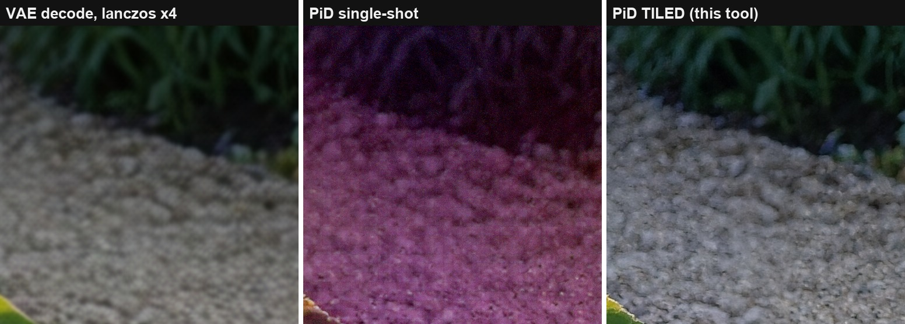
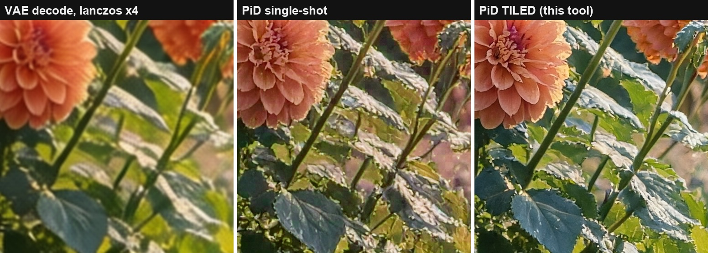
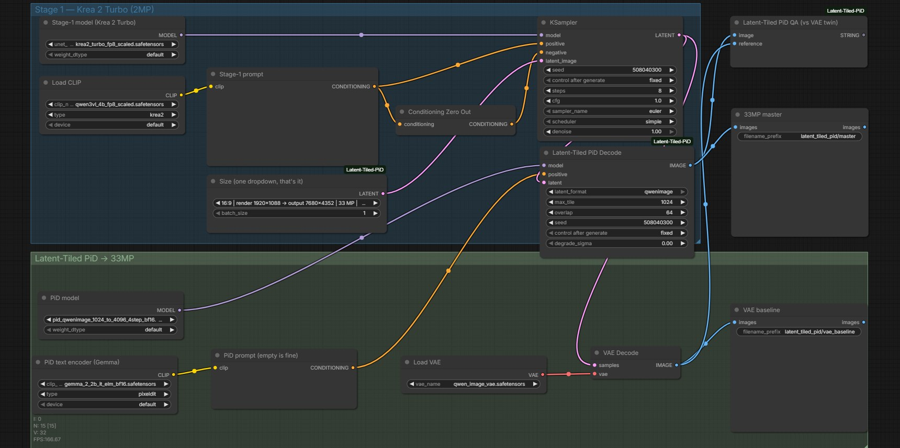

# ComfyUI-Latent-Tiled-PiD

**Tile the latent, not the pixels.**

[](https://github.com/BennyDaBall930/ComfyUI-Latent-Tiled-PiD/actions/workflows/selftest.yml)
[](LICENSE)

Latent-native tiled decoding for NVIDIA [PiD](https://research.nvidia.com/labs/sil/projects/pid/)
(Pixel Diffusion Decoder, [arXiv:2605.23902](https://arxiv.org/abs/2605.23902)) as native ComfyUI
nodes. One node between KSampler and SaveImage: slices the **generation latent** into overlapping
tiles, decodes every tile as a normal-sized in-envelope PiD job, feather-blends the pixels. Seam-free
33MP from a 2MP latent in about a minute — verified up to **107MP** (13824x7776), with cost scaling
~linearly at roughly **1MP of finished output per second on a single RTX 5090**.


## Why this exists

Single-shot PiD decoding is only trained for the 1024→4096 envelope. Push a 2MP latent through it
and midtone color collapses — whites turn pink, chroma noise everywhere. The model isn't broken;
you're just asking it to perform outside its contract, and it answers in magenta:



That crop sits **directly on the vertical tile seam** — find it. And the same decode that fixes the
color is a genuine detail upgrade over the plain VAE decode:



Existing tiled-PiD flows tile the **decoded image** and VAE-encode each tile back to latent space
before running PiD — a lossy round-trip through tiles that were never real latents. Tiling the
generation latent itself skips all of that: every tile conditions on a bit-exact crop of the latent
the sampler actually produced, PiD's sigma-gated LQ injection keeps tiles globally coherent, and the
complementary raised-cosine feather (weights sum to exactly 1) leaves no seams (worst measured seam
gradient ratio across all test runs: 0.77–1.04, where 1.0 is statistically invisible).

The idea came from a simple observation while measuring the collapse: PiD's RoPE is relative, so a
cropped latent decoded as its own image is indistinguishable from a native render of that size. I
wanted the decode path the paper actually describes — latent in, pixels out — at sizes the single
shot can't reach. This pack is that, as two nodes.

## Nodes

**The one rule to internalize: output resolution = 4x your latent, always.** Feed a bigger latent
and the node adds tiles automatically — there is nothing to configure. 1MP latent → 1 tile → 16MP.
2MP → 4 tiles → 33MP. 6.7MP → 8 tiles → 107MP. Same node, same settings.

### Latent-Tiled PiD Size Picker

`(nothing) -> LATENT` — **start here.** One dropdown, zero math. Wire it where
`EmptySD3LatentImage` would go and pick a line:

```
16:9 | render 1920x1088 -> output 7680x4352 | 33 MP | 4 tiles
```

Every entry is a complete, planner-validated configuration: aspect, the stage-1 render size this
latent will have, the exact output resolution the tiled decode will produce, and how many tiles it
takes. 56 presets across 9 aspect ratios, from single-tile 4K-class up to **244 MP** (1:1,
15616x15616). The 16:9 / 9:16 families carry the render-proven ladder sizes; other aspects and the
largest rungs are planner-validated. There is deliberately no sub-1024 single-tile entry: below
their trained res, stage-1 models go mushy and PiD reinterprets instead of decoding — the ~1024
single-tile entry is the floor on purpose.

> **Model support:** the whole pipeline is tested with **Krea 2 Turbo only** (qwen-family). Other
> qwen-family stage-1 models should behave the same; flux/sd3/sdxl paths exist in the Decode node
> but are untested. If you run something else, run the QA node and trust its verdicts over hope.

### Latent-Tiled PiD Decode

`MODEL + CONDITIONING + LATENT -> IMAGE`

| input | notes |
|---|---|
| `model` | PiD checkpoint via `UNETLoader` (e.g. `pid_qwenimage_1024_to_4096_4step_bf16.safetensors`) |
| `positive` | Gemma-2 `CLIPTextEncode` (CLIPLoader type `pixeldit`); empty prompt works |
| `latent` | generation latent straight off the KSampler — flux / sd3 / sdxl / qwen-family |
| `latent_format` | `qwenimage` default; Flux2 auto-detected from channel count under `flux` |
| `max_tile` | max tile edge in stage-1 px; **1024 = the trained envelope, leave it there** |
| `overlap` | feather band in stage-1 px (x4 in output); 64 default |
| `seed` | tile i noises with `seed + 101*(i+1)` |
| `degrade_sigma` | PiD noisy-latent conditioning for early-exit latents; 0.0 for clean latents |

Runs the checkpoint's distilled 4-step schedule (`0.999, 0.866, 0.634, 0.342, 0`) with `lcm` at
cfg 1.0 internally — the reference PiD configuration; do not expect other schedules to work on a
DMD2-distilled student. Per-tile progress bar, interruptible, no temp files.

### There is no "tile mode" switch — the latent size is the mode

Tile count is derived, not selected: output is always **4x the latent**, and the planner grows the
grid to cover whatever you feed it while keeping every tile inside the envelope. **The Size Picker
node's dropdown IS this table** — use it and skip the math. If you'd rather use a stock
`EmptySD3LatentImage`, set it to one of these (all render-proven on Krea 2 Turbo) and you get the
tile count in the left column:

| tiles | landscape latent | portrait latent | output (landscape) | megapixels |
|---|---|---|---|---|
| 1 | up to 1024x1024 | up to 1024x1024 | up to 4096x4096 | ≤ 16.8 |
| 4 (2x2) | **1920x1088** | 1088x1920 | 7680x4352 | 33.4 |
| 6 (3x2) | **2560x1440** | 1440x2560 | 10240x5760 | 59.0 |
| 8 (4x2) | **3456x1944** | 1944x3456 | 13824x7776 | 107.5 |

Every other knob has exactly one correct value — copy the sizes above and leave these alone:

| setting | value | why |
|---|---|---|
| `max_tile` | 1024 | the trained envelope; lowering it shrinks tiles for VRAM headroom **without changing output size**, raising it re-invites the color collapse |
| `overlap` | 64 | the validated feather band (x4 in output px) |
| `degrade_sigma` | 0.0 | only raise it when decoding deliberately half-denoised latents |
| `latent_format` | `qwenimage` | for Qwen-family models (Krea 2, Qwen-Image); `flux`/`sd3`/`sdxl` for those families |
| `seed` | anything | tile i noises with `seed + 101*(i+1)` |

Want more resolution? Render a bigger latent. There is deliberately no way to force *fewer* tiles
than planned — that would push tiles past the trained envelope, the exact failure this node exists
to prevent. The node prints its plan to the console on every run so you can see what it decided.

### Latent-Tiled PiD QA (vs VAE twin)

`IMAGE + IMAGE -> STRING`. Wire in the decode and the normal `VAEDecode` of the same latent.
Reports **midtone chroma delta** (the collapse detector — healthy decodes calibrate 10–15, collapsed
~30, flag > 20) and **shadow green-bias delta** (flag ±3). Run it whenever you push a new resolution
or model combo.

## Install

```
cd ComfyUI/custom_nodes
git clone https://github.com/BennyDaBall930/ComfyUI-Latent-Tiled-PiD
```

Restart ComfyUI. Nodes are under `latent/pid`. Requires ComfyUI ≥ 0.28 (PiD in core) and the PiD
checkpoints (NVIDIA weights under the
[NVIDIA License](https://huggingface.co/nvidia/PixelDiT-1300M-1024px/blob/main/LICENSE) —
non-commercial research/evaluation use). No python dependencies beyond ComfyUI itself.

## Example workflows

[`example_workflows/krea2_turbo_sizepicker.json`](example_workflows/krea2_turbo_sizepicker.json) —
**the recommended one**: full Krea 2 Turbo pipeline with the Size Picker in front (one dropdown →
KSampler → tiled decode → master), VAE baseline and QA node wired in.

[`example_workflows/krea2_turbo_2mp_to_33mp.json`](example_workflows/krea2_turbo_2mp_to_33mp.json) —
the same pipeline with a stock `EmptySD3LatentImage` at fixed 1920x1088, for people who prefer
typing numbers. Loaded in ComfyUI:



## Tested on

Works on my machine. Here is the machine, in its entirety — if your setup differs and something
breaks, this table is the first thing to check, not the issue tracker:

| component | exact version |
|---|---|
| ComfyUI | **0.30.1** (built against `comfy.sample.sample_custom`, the pixel-space VAE, and core PiD support as of this version) |
| Python | 3.13.12 |
| PyTorch | 2.13.0+cu130 |
| stage-1 model | **Krea 2 Turbo — the ONLY stage-1 model tested** — `krea2_turbo_fp8_scaled.safetensors` + `qwen3vl_4b_fp8_scaled` text encoder (CLIPLoader type `krea2`), 8 steps euler/simple cfg 1.0 |
| PiD checkpoint | `pid_qwenimage_1024_to_4096_4step_bf16.safetensors` (**v1**; the v1.5 checkpoints exist and are so far untested here) |
| GPU | RTX 5090 32 GB, `--use-sage-attention`, cudaMallocAsync |
| verified outputs | 5376x3072 (16.5MP), 7680x4352 (33.4MP), 10240x5760 (59MP), 13824x7776 (107.5MP) |
| test date | 2026-08-04 |

Everything through 59MP passes every QA gate clean. At 107MP the shadow green-bias delta reads +3.9
(a hair past the ±3 flag) — the first sign of tone stretch, disclosed here so nobody has to discover
it for me. If ComfyUI moves its sampling internals in some future version, that is when this pack
needs a patch, not an argument — open an issue **with your versions** and it gets fixed.

## Measurements, methodology, headless version

The full evidence set — reproducible demo, calibration numbers, the past-envelope collapse
characterization, and a headless driver that does the same thing over the ComfyUI API for pipeline
use — lives in the companion repo:
**[pid-tiled-decode](https://github.com/BennyDaBall930/pid-tiled-decode)**.

Also documented there: core ComfyUI `LatentCrop` silently corrupts 5-dim qwen/Wan-family latents
(indexes T/H as if they were H/W). This pack slices latents rank-agnostically and is not affected.

## Credit

- **NVIDIA** — PiD itself: Lu, Wu, Wu, Wang, Ling, Fidler, Ren
  ([nv-tlabs/PiD](https://github.com/nv-tlabs/PiD)). The decoder is theirs; this pack just refuses
  to leave its comfort zone.
- [Merserk/ComfyUI-PiD](https://github.com/Merserk/ComfyUI-PiD) — the image-space tiled upscaler
  design point, credited as prior art.
- Concept, direction and testing: **BennyDaBall930**.

## License & compliance

This repo's code and images (our own generations) are **MIT**. It ships **no NVIDIA model weights
and no NVIDIA code** — the PiD checkpoints come from NVIDIA under the
[NVIDIA License](https://huggingface.co/nvidia/PixelDiT-1300M-1024px/blob/main/LICENSE)
(non-commercial: research and evaluation use); read it before pointing this at anything commercial.
Independent project — not affiliated with, sponsored by, or endorsed by NVIDIA or Comfy Org.

Built & tested locally with care by BennyDaBall930.
